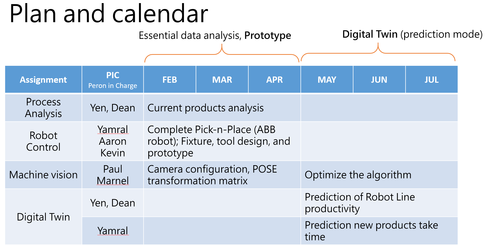
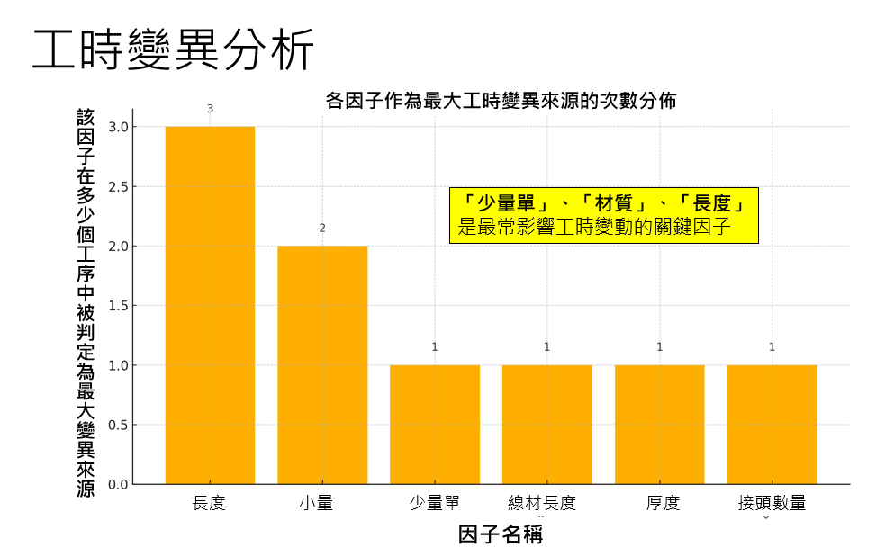

# Digital twin technology for wiring harness parts assembly
## Descrption
- This website serves as an information hub for the cable assembly project.
- In addition to the program code, it includes process analysis, robot control, machine vision and digital twin, some important imformation, and so on.
- This website will also present the CAD drawings, simulation environment, and physical setup of the system.
## Plan and calendar  
  
### Cable Assembly Process Analysis
- There are five main production steps.
- Include 33 subprocess and 109 input data.
- Identify variations from the corresponding input data and feed them into the model for prediction.
  
#### Conclusion:
- Analysis Objective:  
For each production record identified by WorkDetailID, extract key process parameters by decomposing them step-by-step based on the factors and sequence corresponding to its WorkID. Then, calculate the unit production time (SecPerUnit) by dividing actual working time (WorkSec) by the quantity produced (Quantity). This analysis aims to evaluate the impact of various factors on work time variability, serving as a basis for optimizing process efficiency and managing production risks.  
- Specific Recommendations:  
The primary source of process time variability indicates a significant impact on production efficiency. "Small-batch orders" repeatedly appear in the analysis as having a noticeable influence on variability. It is recommended to take the following actions for such work orders:  
Adjust production scheduling to combine small-batch orders into batch processing.  
Simulate large-batch operating modes to reduce time losses from changeovers and setup.  
### Smart Assembly Platform Development

### Image Recognition and Algorithms
### Digital twin development
